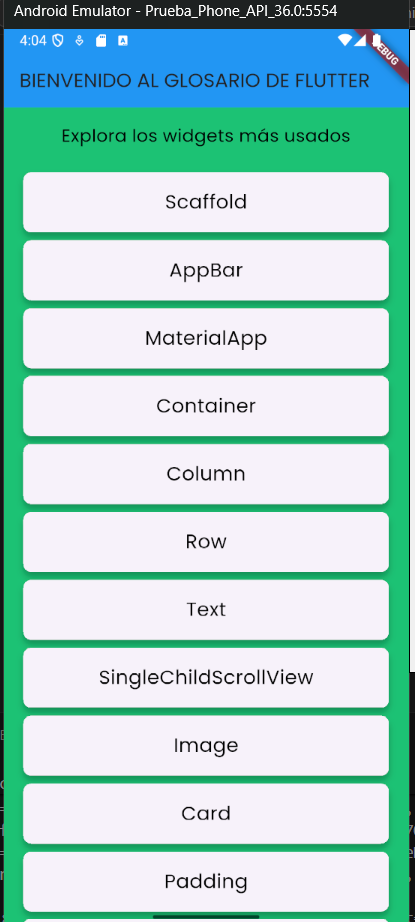
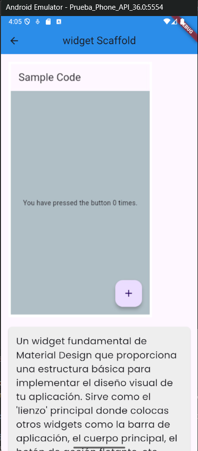
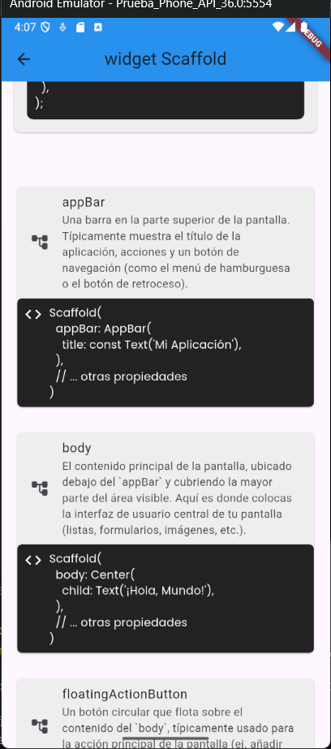
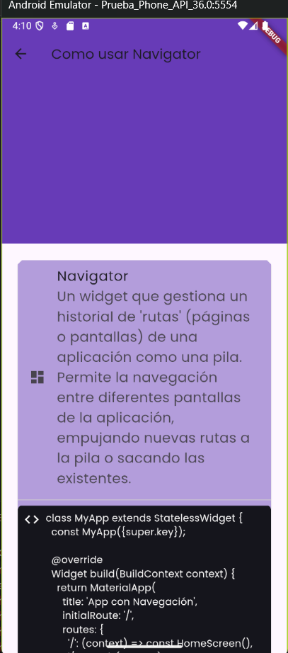
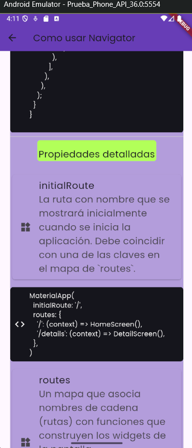
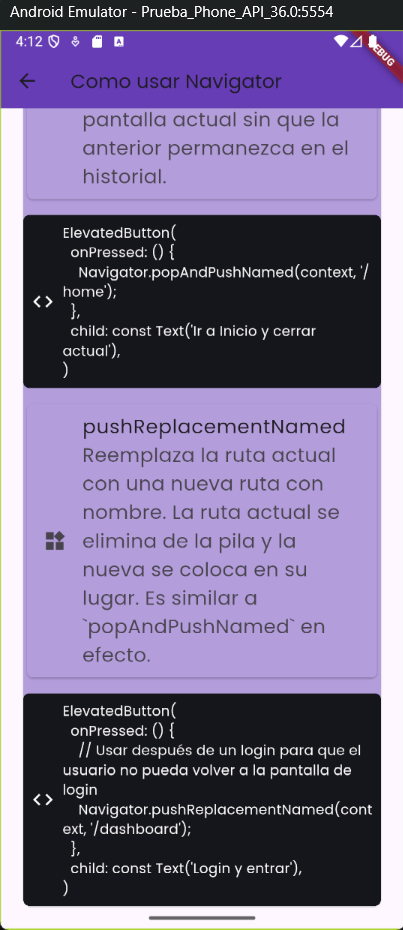
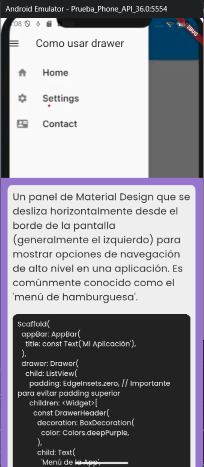
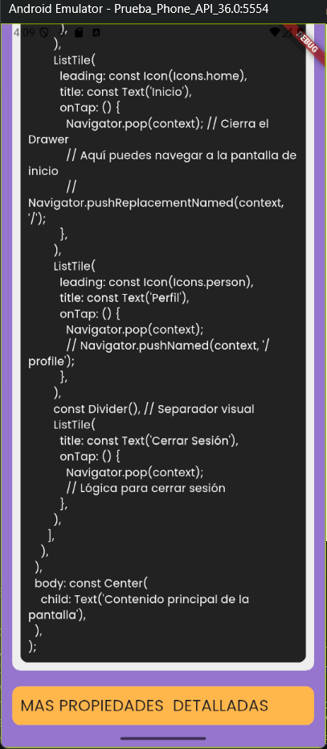
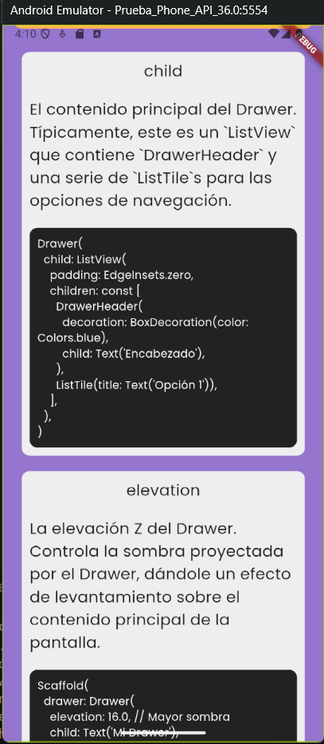

# Practica Daniel - Glosario Flutter

Este proyecto es una aplicación de práctica y referencia diseñada para aprender y demostrar el uso de diversos widgets fundamentales de Flutter. Funciona como un glosario interactivo donde cada "página" ilustra la implementación de un widget específico.

## Descripción

La aplicación está estructurada con un menú principal que permite navegar a diferentes ejemplos de código. Es ideal para principiantes que buscan entender cómo funcionan componentes básicos y diseños en Flutter.

## Widgets y Características Incluidas

El proyecto cubre los siguientes temas con ejemplos prácticos:

*   **Fundamentos de UI**:
    *   `Container`: Uso de contenedores para diseño y decoración.
    *   `Text`: Estilos y manipulación de texto.
    *   `Image`: Carga y visualización de imágenes (desde assets o red).
    *   `Scaffold`: Estructura básica visual de una app Material Design.
    *   `AppBar`: Barras de aplicación superiores.

*   **Layouts (Diseño)**:
    *   `Row` y `Column`: Organización horizontal y vertical de widgets.
    *   `Padding`: Manejo de espacios y márgenes.
    *   `SingleChildScrollView`: Implementación de scroll básico.
    *   `GridView`:
        *   `GridView.builder`: Grillas dinámicas y optimizadas.
        *   `GridView.count`: Grillas con número fijo de columnas.

*   **Componentes Interactivos y de Navegación**:
    *   `Navigator`: Navegación entre pantallas.
    *   `Drawer`: Menú lateral desplegable.
    *   `Card`: Tarjetas con sombra y bordes redondeados.
    *   `ListTile`: Elementos de lista estándar con título, subtítulo e iconos.
    *   `GestureDetector`: Detección de gestos y toques en pantalla.

*   **Configuración General**:
    *   `MaterialApp`: Configuración raíz de la aplicación Flutter.
    *   **Pantalla de Bienvenida**: `Page_Welcome`.

##  Capturas de Pantalla













##  Estructura del Proyecto

El código fuente principal se encuentra en la carpeta `lib/`:

*   `main.dart`: Punto de entrada de la aplicación. Define las rutas y el tema principal.
*   `pages/`: Contiene todas las pantallas individuales para cada widget de práctica.
    *   `Code_example/`: Contiene ejemplos específicos adicionales.

##  Comenzando

1.  **Requisitos**: Asegúrate de tener Flutter instalado y configurado.
2.  **Clonar/Descargar**: Obtén el código fuente.
3.  **Instalar dependencias**:
    ```bash
    flutter pub get
    ```
4.  **Ejecutar**:
    ```bash
    flutter run
    ```

